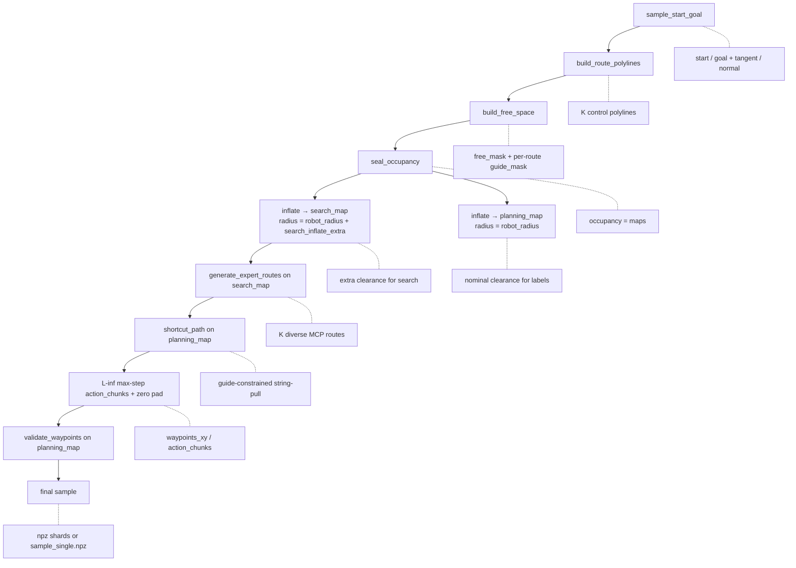
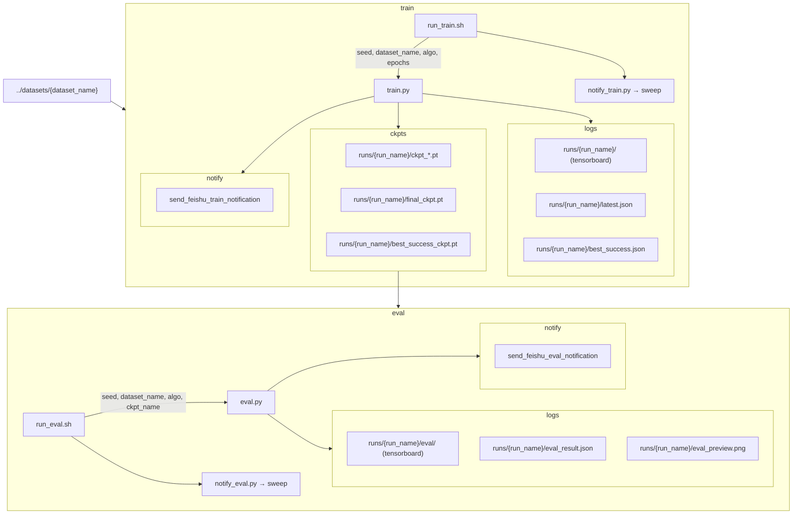
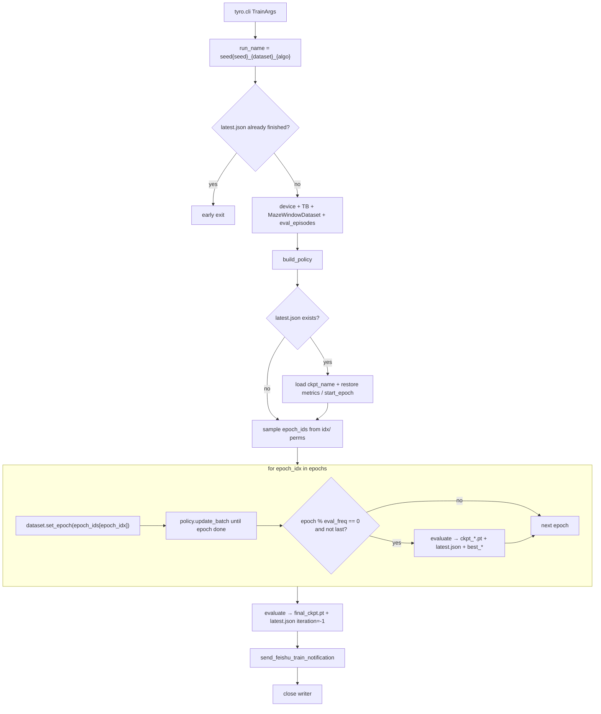
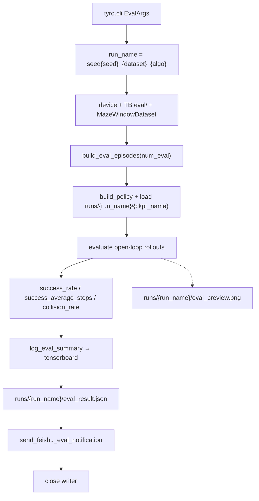

# maze_playground

Multimodal planning-map tools: dataset generation under `bench_data/`, imitation learning under `bench_policy/`.

## Batch generation

```bash
cd bench_data
./run_gen.sh
# or
../.venv/bin/python data_gen.py \
  --num-maps 500 --size 256 --num-routes 4 --seed 56 \
  --output-dir ../dataset/genplan256_r4
```

`run_gen.sh` loops over `NUM_ROUTES_LIST` (default `2 3 4 5 6`), writing each dataset to `${OUTPUT_DIR}_r${num_routes}` with `seed = num_routes * 14`.

Outputs per dataset:

| Path | Content |
|------|---------|
| `shard_XXXXX.npz` | Batched sample tensors |
| `preview.png` | Collage of leading maps + routes |
| `manifest.json` | Shard list and encoding notes |
| `config.json` | Resolved `GenCfg` |

### Sample tensors (`shard_*.npz`)

| Key | Meaning |
|-----|---------|
| `maps` | Occupancy (`1` = occupied) |
| `planning_maps` | Occupancy dilated by `robot_radius` |
| `starts_rc` / `goals_rc` | Start / goal in `[row, col]` |
| `waypoints_xy` | `(K, H+1, 2)` normalized absolute `xy` |
| `action_chunks` | `(K, H, 2)` pixel `(dx, dy)` with `|dx|,|dy| <= max_abs_delta` (default 5); L∞-maximal steps, then zeros after goal |
| `raw_paths_rc` | Grid expert paths (padded) |
| `route_lengths` / `optimal_lengths` | Path length stats |

Decode: `pixel[i+1] = pixel[i] + action[i]`, `q = pixel / (size - 1)`.

## Single-map debug

Dump every intermediate stage for one accepted map:

```bash
cd bench_data
../.venv/bin/python data_gen_single.py \
  --output-dir ../dataset/genplan256_single \
  --size 256 --num-routes 4 --seed 7
```

| Path | Content |
|------|---------|
| `images/*.png` | Colored overlay per stage |
| `arrays/*.npy` | Raw masks / paths / costs |
| `steps.json` | Ordered stage list |
| `sample_single.npz` | Final sample |

## Generation pipeline



### Stage notes

1. **start / goal** — Opposite-side endpoints; tangent / normal for lateral route offset.
2. **route polylines** — `K` shared-endpoint control curves with sinusoidal envelope and jitter.
3. **free space** — Carve corridors (width ~ `2–3 × robot_radius`), rooms, cross-links, side branches; build per-route guide masks. No protected core / pillars.
4. **seal occupancy** — `occupancy = ~free_mask`, force border, keep start/goal free → stored as `maps`.
5. **dual inflate**
   - `search_map`: `robot_radius + search_inflate_extra` (default extra `3`) — expert search stays off walls.
   - `planning_map`: `robot_radius` — shortcut and waypoint validation; stored as `planning_maps`.
6. **expert routes** — On `search_map`, per guide: smooth random cost + guide penalty → MCP path; reject on length / buffered IoU.
7. **shortcut** — On `planning_map`, farthest free chord inside each guide (mode-preserving simplify).
8. **waypoints / actions** — Walk the shortcut path with L∞-maximal pixel steps (`|dx|,|dy| <= max_abs_delta`); pad to fixed `action_horizon` with zeros after the goal.
9. **validate** — Consecutive waypoint chords must be free on `planning_map`.
10. **accept / retry** — Any failed check returns `None`; outer loop retries up to `max_map_attempts`.

## bench_policy

IL training / evaluation on `datasets/{dataset_name}` (build via `bench_data/`).
`run_name = seed{seed}_{dataset_name}_{algo}`.



### train.py



### eval.py



### Quick start

```bash
cd bench_policy
./run_train.sh
# or
../.venv/bin/python train.py \
  --algo bc --dataset-name genplan256_mix --seed 42 --epochs 50

./run_eval.sh
# or
../.venv/bin/python eval.py \
  --algo bc --dataset-name genplan256_mix --seed 42 \
  --ckpt-name best_success_ckpt.pt
```
