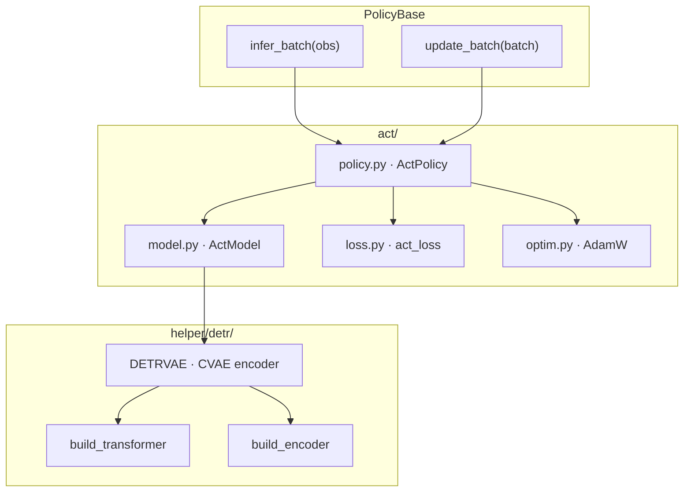
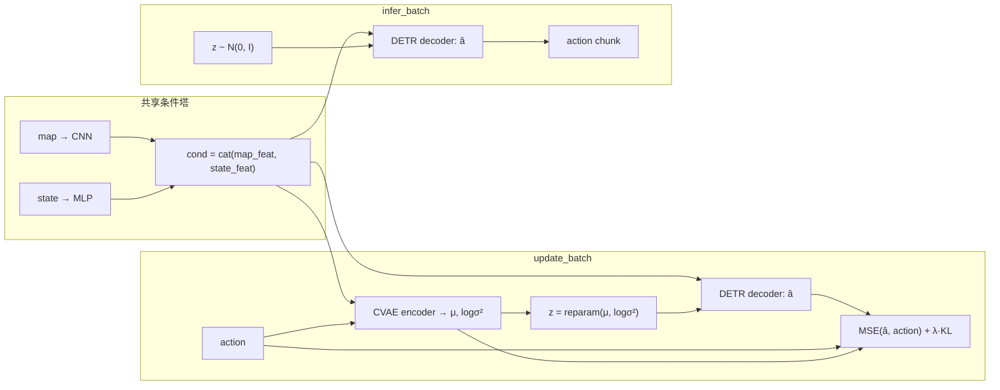
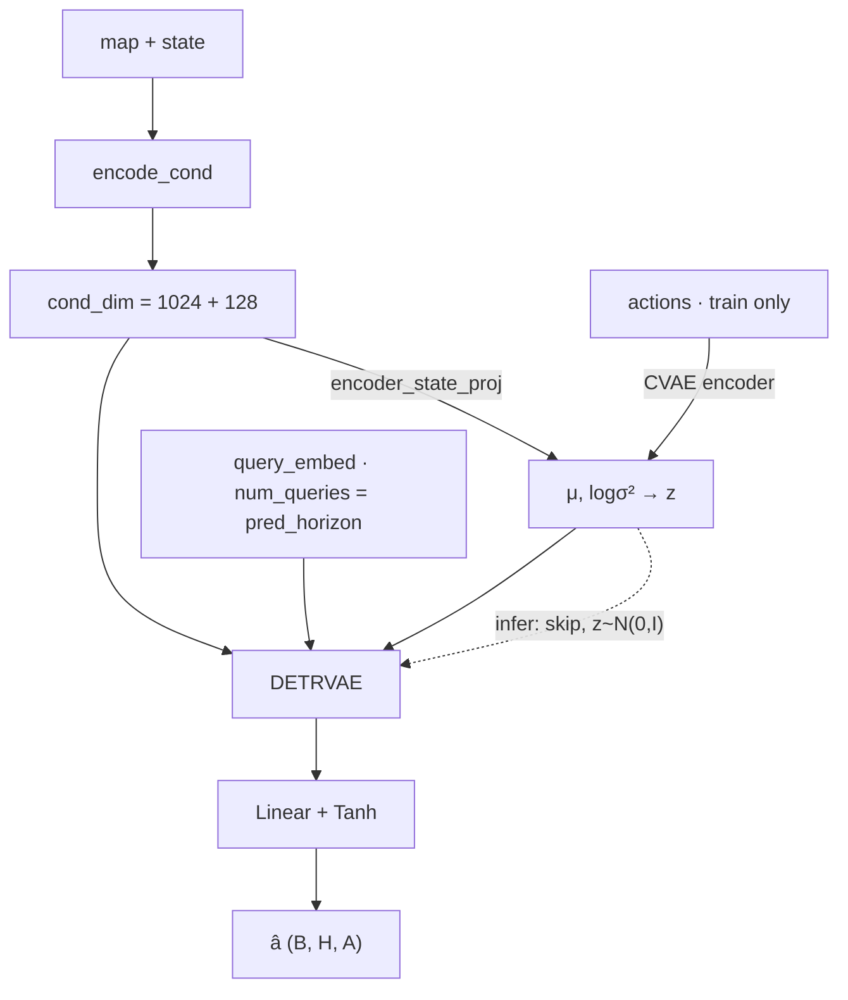

# Action Chunking with Transformers (ACT) 框架

CVAE + DETR 动作分块策略：观测侧与 BC / DP 共用 map CNN + state MLP，动作侧为完整 DETRVAE（含 CVAE encoder），损失为 MSE + 加权 KL。

## 模块分层

| 文件 | 职责 |
|------|------|
| `policy.py` | `ActPolicy`：实现 `infer_batch` / `update_batch` |
| `model.py` | `ActModel`：条件编码 + DETRVAE（训练传 actions，推理 `z~N(0,I)`） |
| `loss.py` | `act_loss`：`MSE + kl_weight * KL(mu, logvar)` |
| `optim.py` | AdamW（与 BC 共用 `helper.optim.build_adamw_optimizer`） |
| `helper/detr/detr_vae.py` | DETRVAE；ACT 路径使用 CVAE encoder |

## 数据流（训练 / 推理）

- **训练**：用 `(cond, action)` 编码后验，重参数采样 `z`，解码 `â`；`λ = kl_weight`（默认 5.0）。
- **推理**：不传 `actions`，从先验 `z ~ N(0, I)` 采样，单次前向得到 chunk。

## ActModel 内部

默认超参见 `ActModelConfig`（与 BC 对齐）：`hidden_dim=256`，`nheads=4`，`enc_layers=2`，`dec_layers=4`，`dim_feedforward=512`，`latent_dim=32`。`ActPolicy.lr = 2e-4`，`kl_weight = 5.0`。

相对 BC：同一 DETR 解码器与条件塔，差异仅在于是否启用 CVAE（后验 / 先验 `z` + KL）。
