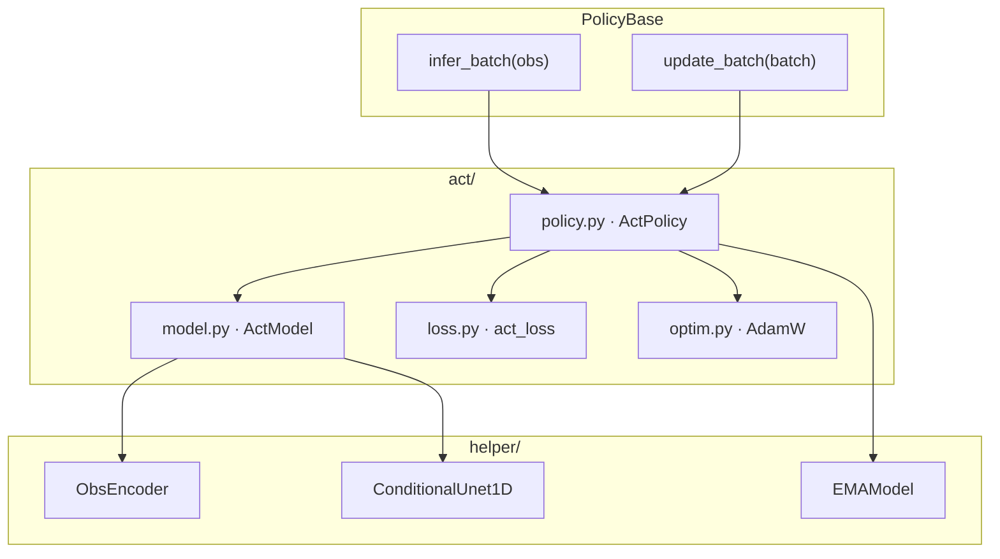
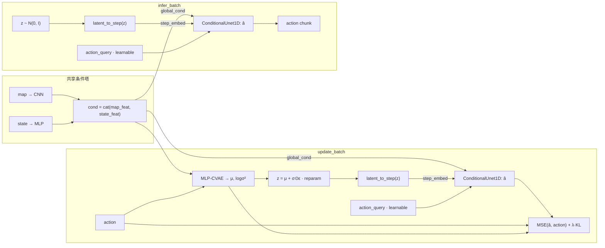

# Action Chunking (ACT) 框架

MLP-CVAE + ConditionalUnet1D 动作分块策略：观测侧与 BC / DP / FM 共用 map CNN + state MLP；UNet 与 BC **同宽**（`global_cond = obs`），CVAE 的 `z` 投影进 diffusion-step 通道（BC 该通道固定 `t=0`）；损失为 MSE + 加权 KL。

## 模块分层

| 文件 | 职责 |
|------|------|
| `policy.py` | `ActPolicy`：实现 `infer_batch` / `update_batch` + EMA |
| `model.py` | `ActModel`：ObsEncoder + MLP-CVAE `z=μ→step_embed` + ConditionalUnet1D |
| `loss.py` | `act_loss`：`MSE + kl_weight * KL(mu, logvar)` |
| `optim.py` | AdamW |
| `helper/obs_encoder.py` | map CNN + state MLP → `cond` |
| `helper/conditional_unet1d.py` | FiLM 条件 1D UNet |
| `helper/ema.py` | 权重 EMA |

## 数据流（训练 / 推理）

- **训练**：跑 CVAE 得 `μ, logσ²`，**reparam 采样** `z = μ + σ ⊙ ε`；`λ = kl_weight`（默认 5.0）。
- **推理**：无 action，从先验采样 `z ~ N(0, I)`。
- **相对 BC**：UNet `global_cond_dim` 相同；差异在 step 通道由 CVAE `μ` 调制 + KL。

默认超参见 `ActModelConfig`：UNet 与 BC / DP / FM 对齐；CVAE：`latent_dim=32`，`cvae_hidden_dim=256`。`ActPolicy.lr = 2e-4`，`kl_weight = 5.0`。
