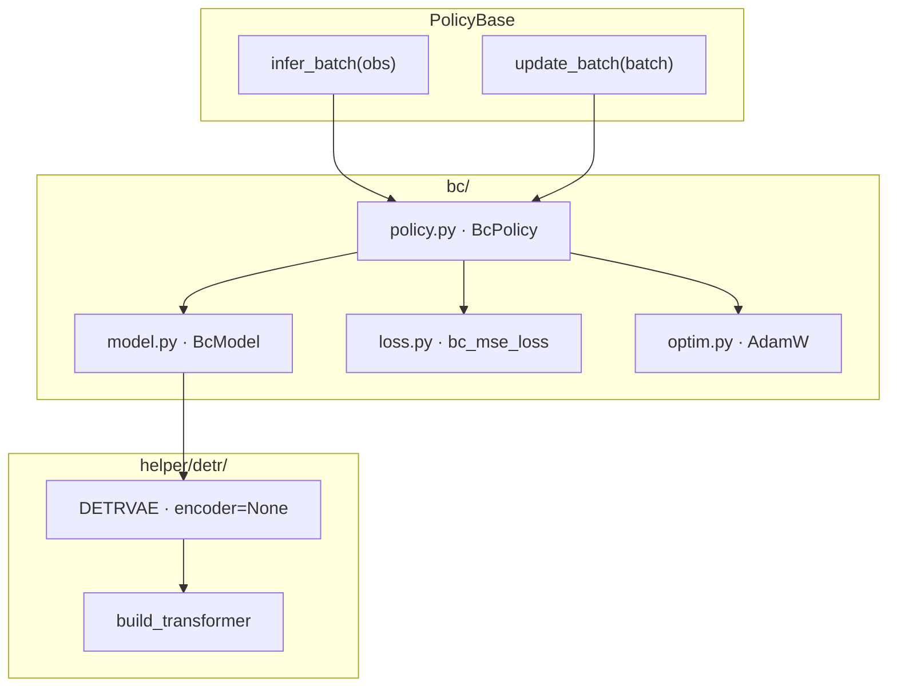
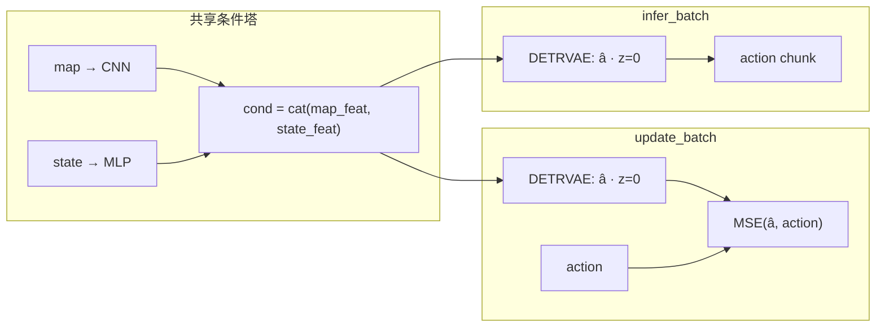
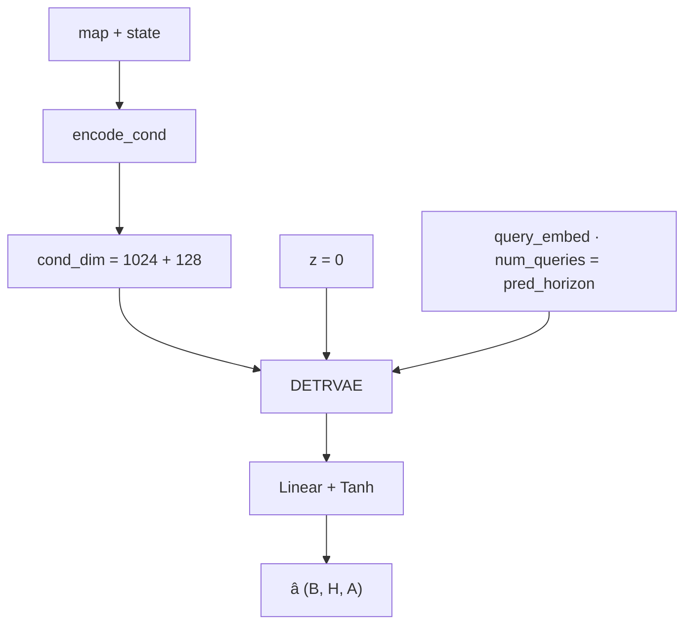

# Behavior Cloning (BC) 框架

确定性 DETR 动作分块策略：观测侧与 ACT / DP 共用 map CNN + state MLP，动作侧为 DETRVAE（`encoder=None`，潜变量固定 `z=0`），对 action chunk 做 MSE。

## 模块分层

| 文件 | 职责 |
|------|------|
| `policy.py` | `BcPolicy`：实现 `infer_batch` / `update_batch` |
| `model.py` | `BcModel`：条件编码 + DETRVAE 解码（`z=0`） |
| `loss.py` | `bc_mse_loss`：action chunk 上的 MSE |
| `optim.py` | AdamW（与 ACT 共用 `helper.optim.build_adamw_optimizer`） |
| `helper/detr/detr_vae.py` | DETRVAE；BC 路径不建 CVAE encoder |

## 数据流（训练 / 推理）

- **训练 / 推理**：同一条单次前向；无加噪、无采样循环；`z` 始终为 0。
- **损失**：仅 `MSE(pred, action)`，无 KL 项。

## BcModel 内部

默认超参见 `BcModelConfig`（与 ACT 对齐，便于隔离 CVAE）：`hidden_dim=256`，`nheads=4`，`enc_layers=2`，`dec_layers=4`，`dim_feedforward=512`。`BcPolicy.lr = 3e-4`。
