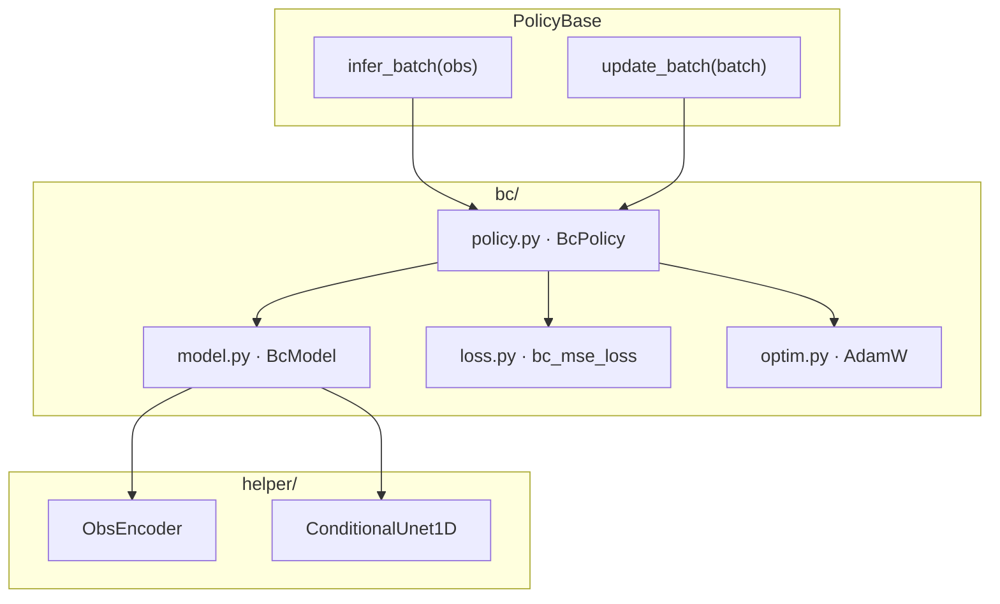
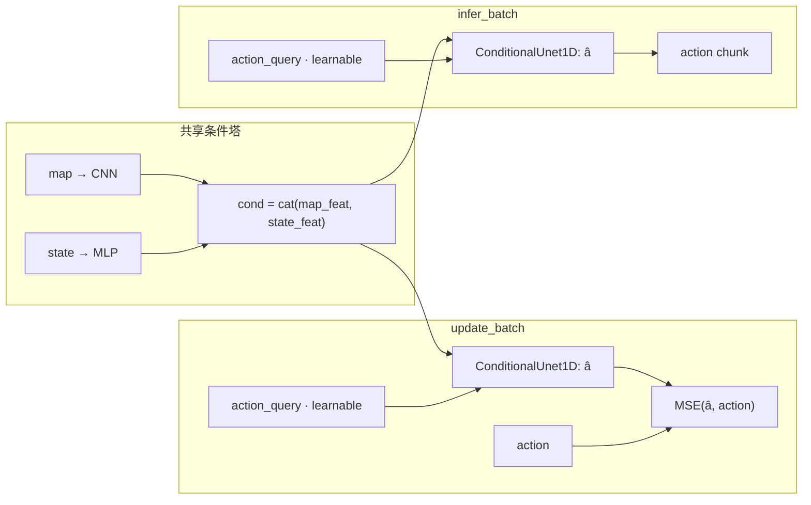
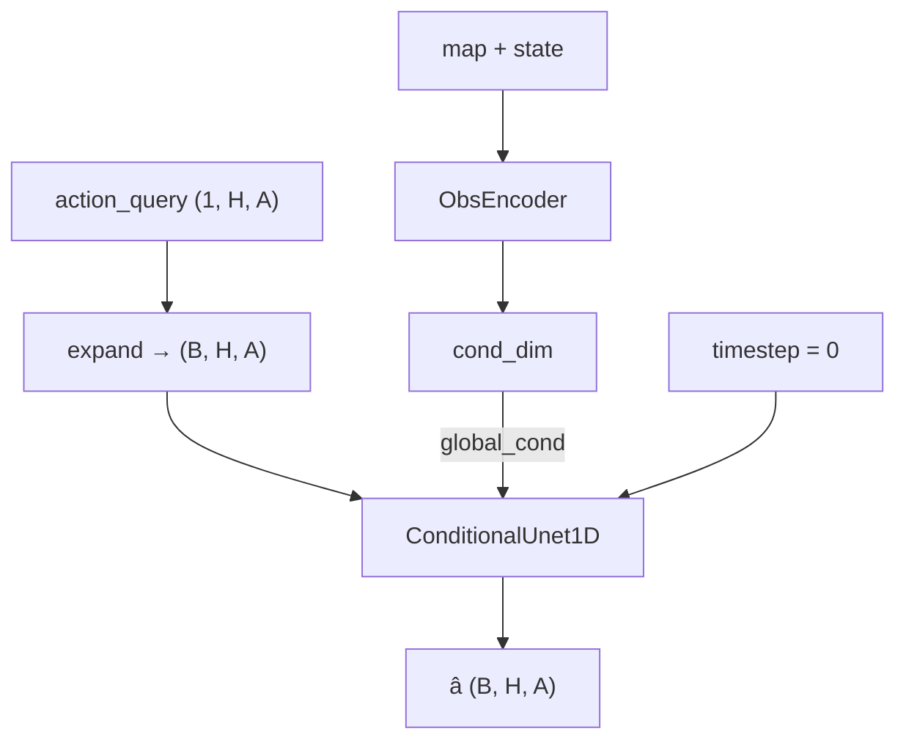

# Behavior Cloning (BC) 框架

确定性 ConditionalUnet1D 动作分块策略：观测侧与 ACT / DP / FM 共用 map CNN + state MLP，动作侧以 learnable action query 作为 UNet 输入、以 `obs_encoder` 输出为 FiLM 条件，对 action chunk 做 MSE。

## 模块分层

| 文件 | 职责 |
|------|------|
| `policy.py` | `BcPolicy`：实现 `infer_batch` / `update_batch` |
| `model.py` | `BcModel`：条件编码 + learnable query → ConditionalUnet1D |
| `loss.py` | `bc_mse_loss`：action chunk 上的 MSE |
| `optim.py` | AdamW |

## 数据流（训练 / 推理）

- **训练 / 推理**：同一条单次前向；无加噪、无采样循环；timestep 固定为 0。
- **损失**：仅 `MSE(pred, action)`，无 KL 项。

## BcModel 内部

默认超参见 `BcModelConfig`（与 DP / FM / ACT 对齐）：`unet_dims=(64,128,256)`，`diffusion_step_embed_dim=64`，`kernel_size=5`，`n_groups=8`。`BcPolicy.lr = 3e-4`。
