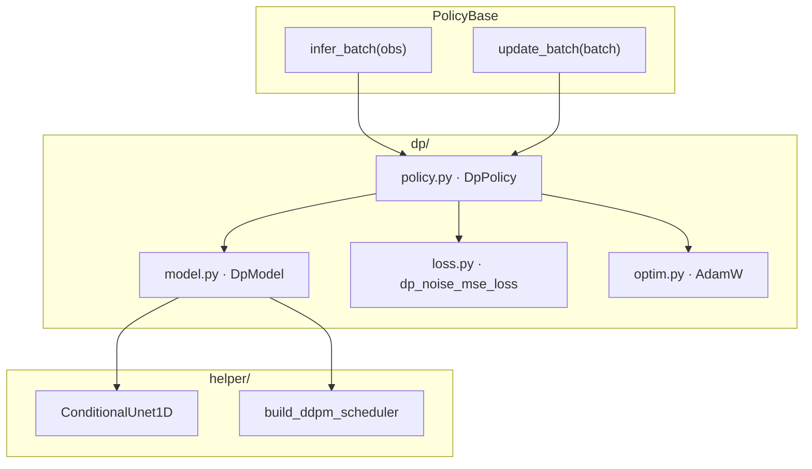
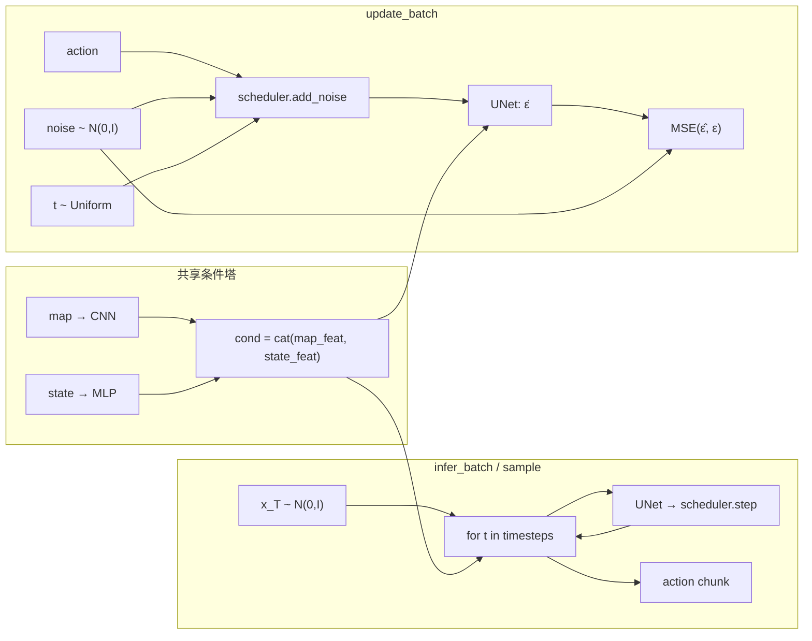
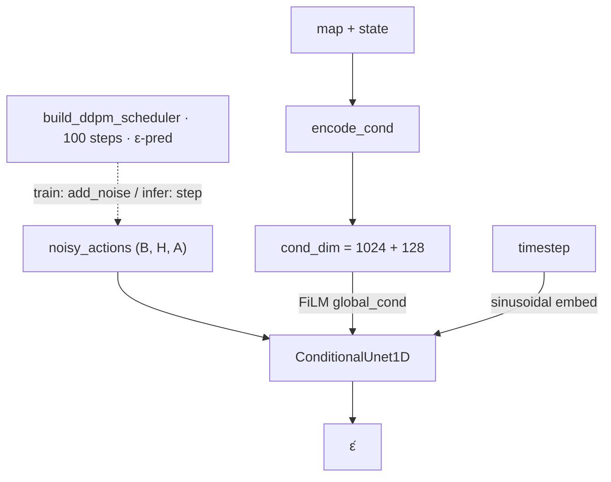

# Diffusion Policy (DP) 框架

条件 DDPM 动作分块策略：观测侧与 BC / ACT 共用 map CNN + state MLP，动作侧为 Conditional 1D UNet + DDPM。

## 模块分层

| 文件 | 职责 |
|------|------|
| `policy.py` | `DpPolicy`：实现 `infer_batch` / `update_batch` |
| `model.py` | `DpModel`：条件编码 + UNet 噪声预测 + DDPM 采样 |
| `loss.py` | `dp_noise_mse_loss`：ε̂ 与 ε 的 MSE |
| `optim.py` | AdamW（ManiSkill DP 默认 betas / weight decay） |
| `helper/conditional_unet1d.py` | FiLM 条件 1D UNet |
| `helper/ddpm_scheduler.py` | 自实现 `DDPMScheduler` / `build_ddpm_scheduler`（无 diffusers） |

## 数据流（训练 / 推理）

- **训练**：对 GT action 加噪 → UNet 预测噪声 → MSE；单次前向。
- **推理**：从高斯噪声出发，按 scheduler `timesteps` 迭代去噪，得到 `(B, pred_horizon, action_dim)`。

## DpModel 内部

默认超参见 `DpModelConfig`：`unet_dims=(64,128,256)`，`num_diffusion_iters=100`；调度器由 `helper.ddpm_scheduler.build_ddpm_scheduler` 提供（ε-pred，`squaredcos_cap_v2`，`clip_sample`）。
