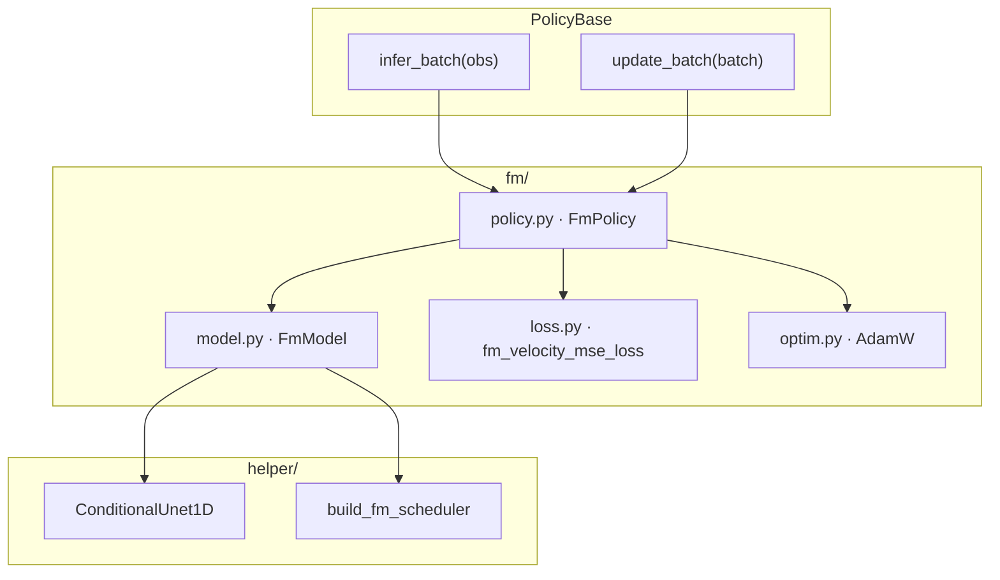
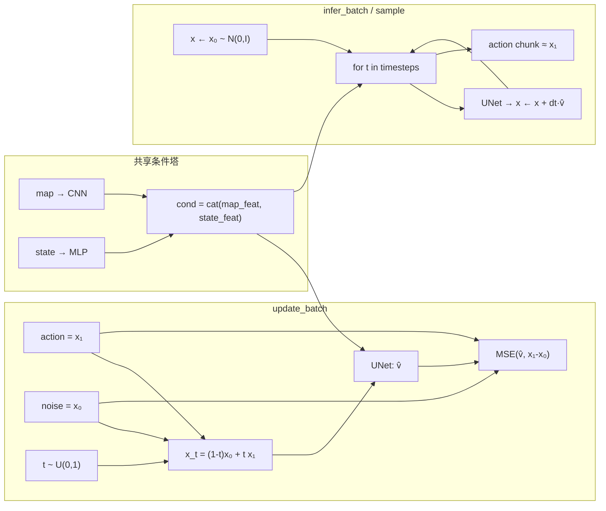
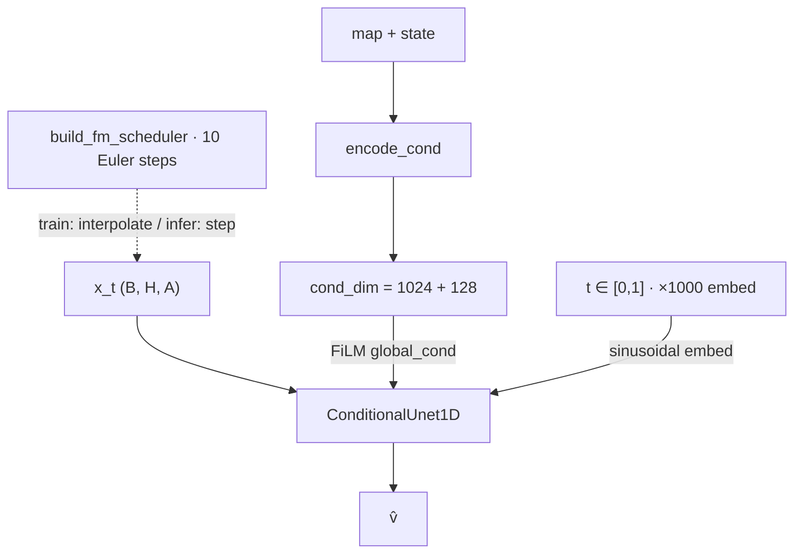

# Flow Matching (FM) 框架

条件 OT Flow Matching 动作分块策略：观测侧与 BC / ACT / DP 共用 map CNN + state MLP，动作侧为 Conditional 1D UNet + 线性路径 / Euler ODE（相对 DP：监督从 ε 改为速度场，推理从 DDPM 改为 ODE）。

## 模块分层

| 文件 | 职责 |
|------|------|
| `policy.py` | `FmPolicy`：实现 `infer_batch` / `update_batch` |
| `model.py` | `FmModel`：条件编码 + UNet 速度预测 + Euler 采样 |
| `loss.py` | `fm_velocity_mse_loss`：v̂ 与 v 的 MSE |
| `optim.py` | AdamW（与 DP 对齐） |
| `helper/conditional_unet1d.py` | FiLM 条件 1D UNet（与 DP 共用） |
| `helper/fm_scheduler.py` | OT 路径插值 / 速度目标 / Euler `step` |

## 数据流（训练 / 推理）

- **训练**：线性插值构造 `x_t` → UNet 预测速度 → MSE；单次前向。
- **推理**：从噪声出发，Euler 积分数步（默认 10）到 `t=1`，得到 `(B, pred_horizon, action_dim)`。

## FmModel 内部

默认超参见 `FmModelConfig`：`unet_dims=(64,128,256)`（与 DP 同骨干），`num_inference_steps=10`；路径为 OT / rectified-flow：`x_t=(1-t)x_0+t x_1`，`v=x_1-x_0`。
